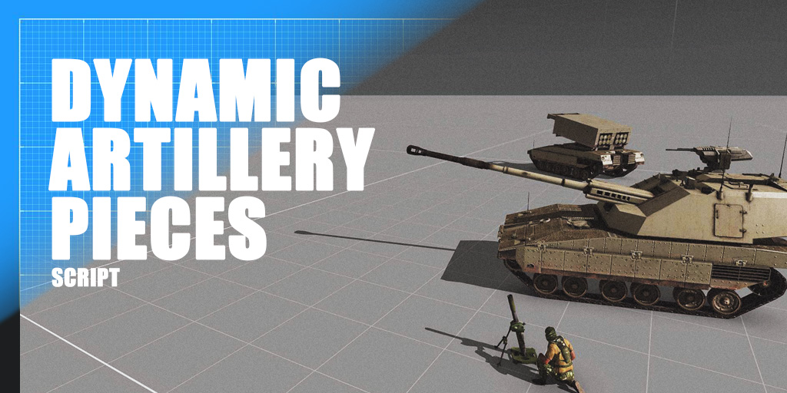

# Arma-3-Dynamic-Artillery-Pieces-Script v1.5
>*Dependencies: none.*

DAP is an Arma 3 script that allows the Mission Editor (you) to create real (or virtual) artillery/mortar fire-missions faster and smarter for one or multiple sides, using Eden marker’s positions and an external fire-missions list where you plan the caliber, ammo type, rounds, cycle of repetition and more. DAP doesn't change any original Arma AI behavior, saving server performance, and preserving the Arma integrity and compatibility with any mod.

**Creation concept:**

Make use of artillery-pieces practical, fast, and scalable for multiplayer or single-player missions.

**Why use DAP to manage artillery:**

​Unlike other scripts, DAP does not require the editor to specify artillery-pieces for each fire-mission. As soon as a fire-mission is triggered, DAP searches for artillery-pieces available at that time that fit the requested caliber, the requested ammunition-type, and have range to the target. This means that for the same target, DAP can use different pieces on the map; just as the same an artillery-piece can be used for multiple fire-missions with different targets. And DAP is absolutely scalable.

## HOW TO INSTALL / DOCUMENTATION

Video demo: soon.

Video tutorials: soon, but subscribe to my channel now, https://youtube.com/@thy1984

Documentation: https://github.com/aldolammel/Arma-3-Dynamic-Artillery-Pieces-Script/blob/main/_DAP_Script_Documentation.pdf

__

## SCRIPT DETAILS

**What you set for each fire mission with DAP:**
- Real or virtual fire mission;
- The side that owns each fire-mission; 
- Potential target sectors (Eden markers); 
- How many artillery-pieces you want in each fire-mission; 
- What caliber these pieces will be (Light, Medium, Heavy, Super Heavy or Combined); 
- Ammunition type (HE, Cluster, Smoke, Flare etc);
- Control the volume of rounds per piece; 
- How many repetition cycles does a fire mission have;
- Triggers will release the fire-mission (trigger activation, timer, kill/destruction).

**What you set globally with DAP:**
- Custom callsign for each artillery side;
- Which piece calibers can use CommandChat to report (On/Off);
- Infinite ammunition (On/Off);
- Prevent artillery-pieces self-propelled to change position (On/Off);
- Prevent artillery-pieces from starting match with no magazines (On/Off);
- Fire-mission areas visible on the player map (On/Off)  **WIP**
- Custom cooldown by caliber among cycles of fire-mission repetition;
- Pre-defined whitelist of pieces working (Arma, DLCs, CDLCs, RHS, CUP, etc);
- Pre-defined whitelist of ammunition working (Arma, DLCs, CDLCs, RHS, CUP, etc);
- Pre-defined blacklist of currently bugged vehicles/static turrets;
- Pre-defined blacklist of currently bugged ammunition;
- Debug mode with simple or deep detailing;
- Etc…

**Automatically DAP Library supports content from:**
- Arma 3;
- Expansion Apex;
- DLC Tanks;
- DLC Contact;
- CDLC Western Sahara;
- CDLC Reaction Forces;
- CDLC Expeditionary Forces;
- CDLC Global Mobilization;
- Mod RHS;
- Mod CUP.
 
**How DAP works technically:** (before installation for advanced editors’ valuation)
There's a workflow in the first pages of the documentation. Check that out!

__

## IDEA AND FIX?

Discussion and known issues: https://forums.bohemia.net/forums/topic/290962-release-dynamic-artillery-pieces-dap/

__

## CHANGELOG

**Dec, 5th 2024 | v1.5.1**

- Added the position checker for artillery and target-markers to verify whether within the map borders;
- Added autofix if editor include multiple artillery-pieces in the same group;
- Fixed the error when the editor, for any reason, removes part of the artillery crew;

**Dec, 4th 2024 | v1.5**

- Added native support to artillery-pieces from CDLC Expeditionary Forces;
- Added automatic schedule management that allows multiples fire-missions at the same time;
- Added rearming management by caliber (with 3D sound effects);
- Added option to prevent pieces self-propelled to move from their original positions;
- Added virtual-fire-mission option (WIP: only HE and CLUSTER options and LIGHT and MEDIUM calibers nowadays);
- Improved the fire-mission feedback messages;
- Improved, each fire-mission was given a codename (customizable) to help identify what the feedback is about;
- Improved, each artillery-piece automatically renamed to the custom side name;
- Improved, the caliber 'ANY' was renamed to 'COMBINED' for better understanding and use;
- Improved, performance;
- Improved the mission-example;
- Fixed if a fire-mission is aborted, no more artillery-pieces keep shelling the target without lose their capacity to engage local threats (with coaxial if appliable);
- Fixed the debug target-markers-counter that was considering DAP markers from disabled sides as well;
- Fixed the debug artillery-pieces-counter that was considering DAP vehicles from disabled sides as well;
- Removed rhs_9k79, rhs_9k79_K, and rhs_9k79_B from the DAP Library. They're bugged;
- Documentation updated;

**Nov, 25th 2024 | v1.0**
- Hello, world.